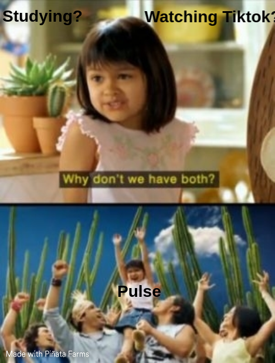

# Pulse

Need to study? Want to watch TikTok though? Our attention spans are lowering (Source: USC Dr. Albright's studies). As we head on, it becomes harder and harder to focus on boring content. In most cases, within minutes you'll be wondering: when will something happen? How do platforms like TikTok or Instagram prey on our shifting mindset?

"In psychological terms [it's] called random reinforcement," Dr. Albright says. "It means sometimes you win, sometimes you lose. And that's how these platforms are designed... they're exactly like a slot machine. Well, the one thing we know is slot machines are addictive. But we don't often talk about how our devices and these platforms and these apps do have these same addictive qualities baked into them."

With Pulse, we take advantage of the ever-changing content of these videos. **We combine the content of coursework, with the addictiveness of TikTok to produce short clips summarizing the most important content of the course**. More accurately, on uploading a lecture recording or slides, Pulse generates a short series of TikToks with the most important content from the lecture. Further, videos produces come in many forms! You could be looking at satisfying videos while Lebron James tweets about "thermodynamics" or you could be watching Elon Musk lecture you himself! With Pulse, you could be watching your favorite celebrities teach you only what you need to know. 

Through our mobile app, we make it easy for anyone to breeze through their generated TikToks (even if you upload the course content on the Pulse website!) by seamlessly syncing user content between their phones and laptops. Our iOS app is written in React Native and supported by a custom REST API to ensure your videos are easily exportable from any device. 

On our web app, users can upload the given course lectures or slides (mp3 and pdf formats), and view summarized notes of the coursework. The web app is supported by a Flask server and uses a combination of the MongoDB and Firebase databases to store data. We use OpenAI's Whisper speech recognition models hosted on a GPU to transcribe video data along with the strength of large language models to generate the most important content). We use a combination of several Python libraries PIL, Open-CV, MoviePy (ffmpeg) for video and image processing, and the TikTok API for Text-to-Speech. 

To generate deepfakes of a few popular celebrities, we employ a modified version of this [Wav2Lip](https://github.com/Rudrabha/Wav2Lip?tab=readme-ov-file) implementation running on GPU-configured containers on [Modal Labs](https://modal.com/). This allows us to lip-sync with high accuracy and quality. Additionally, to make voice clones of those celebrities, we also use some few-shot prompting via [ElevenLab](https://elevenlabs.io/)'s API for text-to-speech. 

We let students learn in their ways, and at their own pace with our content creation. Our videos keep students hooked with the graphics while letting them learn coursework. In the future, we to improve continuously through feedback mechanisms, enhanced interactivity, and staying attuned to emerging educational technologies.

With Pulse, we bring the education to you. 

